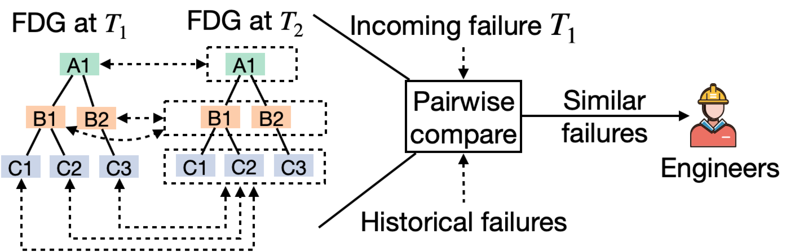
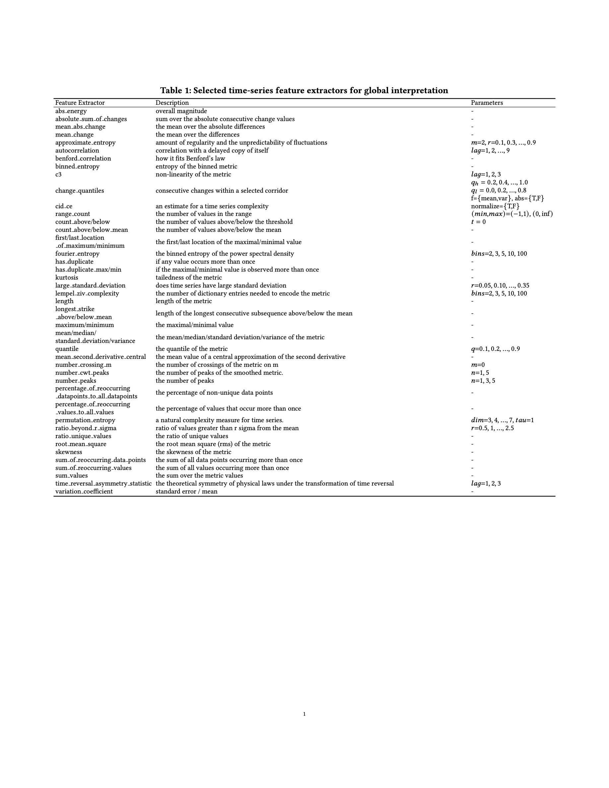

# DejaVu-Omni
## Table of Contents
=================

- [DejaVu-Omni](#dejavu-omni)
  - [Table of Contents](#table-of-contents)
  - [Code](#code)
    - [Install](#install)
    - [Usage](#usage)
  - [Datasets](#datasets)
  - [Deployment and Failure Injection Scripts of Train-Ticket](#deployment-and-failure-injection-scripts-of-train-ticket)
  - [Citation](#citation)
  - [Supplementary details](#supplementary-details)
    - [Local interpretation](#local-interpretation)
    - [Global interpretation](#global-interpretation)
  
## Code
### Install
1. All the software requirements are already pre-installed in the Docker image below. The requirements are also listed in `requirements.txt` and `requirements-dev.txt`. Note that `DGL 0.8` is not released yet when I did this work, so I installed `DGL 0.8` manually from the source code. PyTorch version should be equal to or greater than 1.11.0.
   ```bash
   docker pull lizytalk/dejavu
   ```
2. Pull the code from GitHub
   ```bash
   git pull https://github.com/NetManAIOps/DejaVu-Omni.git DejaVu-Omni
   ```
3. Download the datasets following the link in the GitHub repo and extract the datasets into `./DejaVu-Omni/data`
4. I use the command `realpath` in the example commands below, which is not bundled in macOS and Windows. On macOS, you can install it by `brew install coreutils`.
5. Start a Docker container with our image and enter its shell
   ```bash
   docker run -it --rm -v $(realpath DejaVu-Omni):/workspace lizytalk/dejavu bash
   ```
6. Run `direnv allow` in the shell of the Docker container to set the environment variables.
7. Run experiments in the shell of the Docker container following the usage table as follows.


### Usage

#### Fault Localization
For fault localizaion, we can use four datasets (A, B, C and D). All scripts for DejaVu-Omni and baselines can be found in `scripts/fault_localization`. Run `bash scripts/fault_localization/run_all.sh` for all algorithms on four datasets.

The commands would print a `one-line summary` in the end, including the following fields: `A@1`, `A@2`, `A@3`, `A@5`, `MAR`, `Time`, `Epoch`, `Valid Epoch`, `output_dir`, `val_loss`, `val_MAR`, `val_A@1`, `command`, `git_commit_url`, which are the desrired results.

#### Non-Recurring Failure Detection
For non-recurring failure detection, we can use four datasets (A, B, C and D). All scripts for DejaVu-Omni and baselines can be found in `scripts/non_recurring_failure_detection`. Run `bash scripts/non_recurring_failure_detection/run_all.sh` for all algorithms on four datasets.

The commands would print a `one-line summary`, including the following fields: `A@1`, `A@2`, `A@3`, `A@5`, `MAR`, `recur_A@1`, `recur_A@2`, `recur_A@3`, `recur_A@5`, `recur_MAR`, `Time`, `Epoch`, `Valid Epoch`, `output_dir`, `val_loss`, `val_MAR`, `val_A@1`, `command`, `git_commit_url`, which are the desrired results.

Then, the commands would also print the threshold for non-reucrring failure detection together with precision, recall and f-score.

#### Concept Drift Adaption after System Changes
For concept drift adaption after system changes, we can dataset E. Firstly drift metrics using `notebooks/concept_drift_adaption.ipynb`, and then run fault localization for failures after system changes. All scripts for DejaVu-Omni and baselines can be found in `scripts/concept_drift_adaption`. Run `bash scripts/concept_drift_adaption/run_all.sh` for all algorithms.

The commands would print a `one-line summary`, including the following fields: `A@1`, `A@2`, `A@3`, `A@5`, `MAR`, `drift_A@1`, `drift_A@2`, `drift_A@3`, `drift_A@5`, `drift_MAR`, `non_drift_A@1`, `non_drift_A@2`, `non_drift_A@3`, `non_drift_A@5`, `non_drift_MAR`, `Time`, `Epoch`, `Valid Epoch`, `output_dir`, `val_loss`, `val_MAR`, `val_A@1`, `command`, `git_commit_url`, which are the desrired results.

#### Interpretation
|Algorithm|Usage|
|---|---|
|Global interpretation|Run `notebooks/explain.py` as a jupyter notebook with `jupytext`|
|Local interpretation|`DejaVu/explanability/similar_faults.py`|

Totally, the main experiment commands of DejaVu-Omni should output as follows:
- FDG message, including the data paths, edge types, the number of nodes (failure units), the number of metrics, the metrics of each failure class.
- Traning setup message: the faults used for training, validation and testing.
- Model architecture: model parameters in each part, total params
- Training process: the training/validation/testing loss and accuracy
- Time Report.
- command output one-line summary.

## Datasets

The datasets A, B, C, D, E are public at :
- https://www.dropbox.com/scl/fo/2jl3iem1dfuo3s7na7ebg/ALeZNJrcSg_jWvZsyPhBVMA?rlkey=ccfy5tnuwl18smrxt2m5lkgie&st=5q8yhby7&dl=0
In each dataset, `graph.yml` or `graphs/*.yml` are FDGs, `metrics.csv` and `metrics.pkl` are metrics, `metrics.norm.csv` and `metrics.norm.pkl` are normalized metrics, and `faults.csv` is failures (including ground truths).
`FDG.pkl` is a pickle of the FDG object, which contains all the above data.
Note that the pickle files are not compatible in different Python and Pandas versions. So if you cannot load the pickles, just ignore and delete them. They are only used to speed up data load.
Particulally, in dataset E which is used for concept drift adaption after system changes, `system_change.json` contains a change list, in which present a change with its start time and end time.

## Deployment and Failure Injection Scripts of Train-Ticket
https://github.com/lizeyan/train-ticket


## Supplementary details
### Local interpretation



Since the DejaVu model is trained with historical failures, it is straightforward to interpret how it diagnoses a given failure by figuring out from which historical failures it learns to localize the root causes.
Therefore, we propose a pairwise failure similarity function based on the aggregated features extracted by the DejaVu model.
Compared with raw metrics, the extracted features are of much lower dimension and contain little useless information, which the DejaVu model ignores.
However, computing failure similarity is not trivial due to the generalizability of DejaVu.
For example, suppose that the features are $1$ for root-cause failure units and $0$ for other failure units and there are four failure units ($v_1$, $v_2$, $v_3$, $v_4$).
Then for two similar failures which occur at $v_1$ and $v_2$ respectively, their feature vectors are $(1, 0, 0, 0)$ and $(0, 1, 0, 0)$ respectively, which are dissimilar with respect to common similarity metrics (e.g., Manhattan or Euclidean).


To solve this problem, we calculate similarities based on failure classes rather than single failure units.
As shown in \cref{fig:local-interpretation}, for each failure units at an in-coming failure $T_1$, we compare it with each unit of the corresponding failure classes at a historical failure $T_2$ and take the minimal similarity as its similarity to $T_2$.
Then, we average the similarities to T2 if all units with their suspicious scores (of $T_1$) as the weights.
It is because we only care about those failure units that matter in the current failure when finding similar historical failures.
In summary, the similarity function to compare $T_1$ and $T_2$ can be formalized as follows:
$$
d(T_1, T_2)=\frac{1}{|V|}\sum_{v\in V}s_{T_1}(v)(\min_{v' \in N_c(v;G)}||\boldsymbol{\hat{f}}^{(T_1, v)}-\boldsymbol{\hat{f}}^{(T_2, v')}||_1)
$$
where $N_c(v;G)$ denotes the failure units of the same class as $v$ in $G$, and $||\cdot||_1$ denotes $L1$ norm.


For an in-coming failure, we calculate its similarity to each historical failure and recommend the top-k most similar ones to engineers.
Our model is believed to learn localizing the root causes from these similar historical failures.
Furthermore, engineers can also directly refer to the failure tickets of these historical failures for their diagnosis and mitigation process.
Note that sometimes the most similar historical failures may have different failure classes to the localization results due to imperfect similarity calculation.
In such cases, we discard and ignore such historical failures.


### Global interpretation
The selected time-series features are listed as follows:

